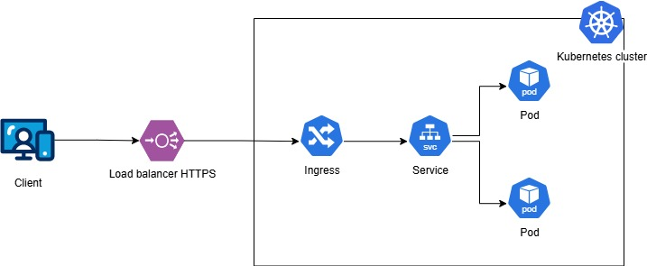

# Demo Devops Java

This is a simple application to be used in the technical test of DevOps.

## Getting Started

### Prerequisites

- Java Version 17
- Spring Boot 3.0.5
- Maven

### Installation

Clone this repo.

```bash
git clone https://bitbucket.org/devsu/demo-devops-java.git
```

### Database

The database is generated as a file in the main path when the project is first run, and its name is `test.mv.db`.

Consider giving access permissions to the file for proper functioning.

## Usage

To run tests you can use this command.

```bash
mvn clean test
```

To run locally the project you can use this command.

```bash
mvn spring-boot:run
```

Open http://127.0.0.1:8000/api/swagger-ui.html with your browser to see the result.

### Features

These services can perform,

#### Create User

To create a user, the endpoint **/api/users** must be consumed with the following parameters:

```bash
  Method: POST
```

```json
{
    "dni": "dni",
    "name": "name"
}
```

If the response is successful, the service will return an HTTP Status 200 and a message with the following structure:

```json
{
    "id": 1,
    "dni": "dni",
    "name": "name"
}
```

If the response is unsuccessful, we will receive status 400 and the following message:

```json
{
    "errors": [
        "error"
    ]
}
```

#### Get Users

To get all users, the endpoint **/api/users** must be consumed with the following parameters:

```bash
  Method: GET
```

If the response is successful, the service will return an HTTP Status 200 and a message with the following structure:

```json
[
    {
        "id": 1,
        "dni": "dni",
        "name": "name"
    }
]
```

#### Get User

To get an user, the endpoint **/api/users/<id>** must be consumed with the following parameters:

```bash
  Method: GET
```

If the response is successful, the service will return an HTTP Status 200 and a message with the following structure:

```json
{
    "id": 1,
    "dni": "dni",
    "name": "name"
}
```

If the user id does not exist, we will receive status 404 and the following message:

```json
{
    "errors": [
        "User not found: <id>"
    ]
}
```

If the response is unsuccessful, we will receive status 400 and the following message:

```json
{
    "errors": [
        "error"
    ]
}
```

## Diagrama de la solución

Tenemos el diagrama de la solución, utilizando los recursos 
de kubernetes, Ingress, Service, Deployment(Pods)

## Resultado ejecución pipeline
El pipeline se inicia cuando se sube algún cambio a la rama
master (push) obteniendo como resultado el siguiente
pipeline como se indica en la siguiente figura


En el job build tenemos las validaciones de pruebas unitarias
análisis estático de código, la generación de la imagen
docker y su correcta publicación en DockerHub

En el job deploy tenemos el despliegue de la imagen
docker generada en el build utilizando minikube
y además se realiza dentro del job en el paso TEST ACCESS
TO PODS THROUGH INGRESS que la app responda al
endpoint /api/users teniendo una respuesta exitosa.


Los archivos de despliegue en kubernetes se encuentran
en la carpeta /k8s del proyecto.

## License

Copyright © 2023 Devsu. All rights reserved.
